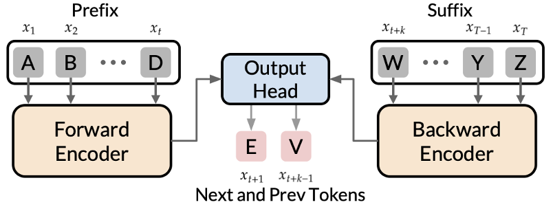

# The Belief State Transformer
ICLR 2025 \
[Edward S. Hu](https://edwardshu.com/) <sup>1,2</sup>,
[Kwangjun Ahn](https://sites.mit.edu/kjahn/) <sup>1</sup>,
[Qinghua Liu](https://qinghual2020.github.io/)<sup>1</sup>,
[Haoran Xu](https://ryanxhr.github.io/)<sup>1,3</sup>,
[Manan Tomar](https://manantomar.github.io/)<sup>1,4</sup>,
Ada Langford<sup>1</sup>,
[Dinesh Jayaraman](https://www.seas.upenn.edu/~dineshj/)<sup>2</sup>, 
[Alex Lamb](https://sites.google.com/view/alexmlamb/home)<sup>1</sup>,
[John Langford](https://hunch.net/~jl/)<sup>1</sup>

<sup>1</sup>Microsoft Research,
<sup>2</sup>University of Pennsylvania,
<sup>3</sup>UT Austin,
<sup>4</sup>University of Alberta

This is the official codebase for the paper "The Belief State Transformer", based on the [nanoGPT repository](https://github.com/karpathy/nanoGPT) by Andrej Karpathy.



To learn more:
- [Paper](https://arxiv.org/abs/2410.23506)
- [Website](https://edwardshu.com/bst-website/)
- [Talk at the Microsoft Research Forum](https://www.microsoft.com/en-us/research/articles/belief-state-transformers/)


## Install
```
pip install -r requirements.txt
```

Note that Pytorch 2.6 or later is needed for the code to run, otherwise there will be an error about torch.distributed.fsdp.  

## Quick start for stargraph experiments
We are following the setup in [The Pitfalls of Next-Token Prediction](https://proceedings.mlr.press/v235/bachmann24a.html) by Gregor Bachmann, Vaishnavh Nagarajan.  

The data preparation code is as follows.

For G(2,5):
```sh
python data/stargraph/prepare.py --num_samples 8000000 --num_paths 2 --path_length 5 --max_nodes 50   
```


For G(2,10):
```sh
python data/stargraph/prepare.py --num_samples 8000000 --num_paths 2 --path_length 10 --max_nodes 50   
```


For G(5,5):
```sh
python data/stargraph/prepare.py --num_samples 8000000 --num_paths 5 --path_length 5 --max_nodes 50   
```

This creates a data file (such as `graph_2_5_sample_8000000.txt`) in the data directory `data/stargraph/`.


After data is generated, you can run the following line to train a model. When running on a single GPU on a multi-gpu machine, it is necessary to set the environment variable CUDA_VISIBLE_DEVICES: 

For G(2,5):
```sh
CUDA_VISIBLE_DEVICES=0 python train.py --config config/bst_stargraph_defaults.yaml data.stargraph_data_path="data/stargraph/graph_2_5_sample_8000000.txt"
```


For G(2,10):
```sh
CUDA_VISIBLE_DEVICES=0 python train.py --config config/bst_stargraph_defaults.yaml data.stargraph_data_path="data/stargraph/graph_2_10_sample_8000000.txt"
```


For G(5,5):
```sh
CUDA_VISIBLE_DEVICES=0 python train.py --config config/bst_stargraph_defaults.yaml data.stargraph_data_path="data/stargraph/graph_5_5_sample_8000000.txt"
```
When training on the G(5,5) stargraph with a single H100 GPU and the default yaml file, the number of iterations per second should be about 1.2.  The training loss should be about 2.85 at 100 iterations and drop to nearly zero by 4000 iterations.  

## Quick start for tinystories experiments
No data preparation is necessary for tinystories. To run training, the command is: 
```sh
CUDA_VISIBLE_DEVICES=0 python train.py --config <train_config>
```
To run inference, the command is:
```sh
CUDA_VISIBLE_DEVICES=0 python inference.py --config <config> --checkpoint_path <trained_model> --sampling_mode <sampling_mode>
```
A sample config for tinystories can be found in `config/bst_tinystories_defaults.yaml`.

To train on multiple GPUs, launch with Fabric. For example:
```sh
fabric run --strategy ddp --devices 4 --precision bf16-mixed train.py --config <train_config>
```
### Evaluation of models inference on tinystories (Fill-in-the-Middle)
This pipeline uses OpenAI GPT judge, and it requires `pip install openai`.

Make sure to set the `OPENAI_API_KEY` environment variables before using the API, and select the GPT Judge model via `--deployment_name`. The default is `gpt-4o-mini-2024-07-18`. To learn more, please refer to the README inside the folder `tinystories_judge`.

Two different models generated by inference.py can be evaluated using a GPT judge. The script is:
```sh
python tinystories_judge/judge_bst_pipeline.py --file1_path <file1_path> --file2_path <file2_path>
```


### Pretokenized tinystories
There is a optional tinystories pretokenization script at `data/tinystories/prepare.py`, which will generate pretokenized binary files that can then be loaded with the `PretokenizedDataModule`.

Example config to load the pretokenized files:
```yaml
data:
  # Use the "pretokenized" dataset type
  dataset: pretokenized

  # Path to the directory containing binary files
  pretokenized_data_path: "data/tinystories/tinystories2-ascii"

  # Can be a list of file names or a list of [file, weight] pairs
  pretokenized_train_data:
    - "tinystories2_train_000000.npy"
    - "tinystories2_train_000001.npy"
    - "tinystories2_train_000002.npy"
    - "tinystories2_train_000003.npy"
    - "tinystories2_train_000004.npy"
    - "tinystories2_train_000005.npy"
    - "tinystories2_train_000006.npy"

  pretokenized_val_data:
    - "tinystories2_val_000000.npy"

  # Huggingface repo name or file path to load the tokenizer used
  # This is undefined for tinystories because we have a custom tokenizer
  tokenizer_name_or_path: ""

  # Fallback if tokenizer_name_or_path is not specified
  # This is the EOS token id for the custom tinystories tokenizer
  tokenizer_eos_id: 1
```

## Citation

```bibtex
@inproceedings{
  hu2025the,
  title={The Belief State Transformer},
  author={Edward S. Hu and Kwangjun Ahn and Qinghua Liu and Haoran Xu and Manan Tomar and Ada Langford and Dinesh Jayaraman and Alex Lamb and John Langford},
  booktitle={The Thirteenth International Conference on Learning Representations},
  year={2025},
  url={https://openreview.net/forum?id=ThRMTCgpvo}
}
```